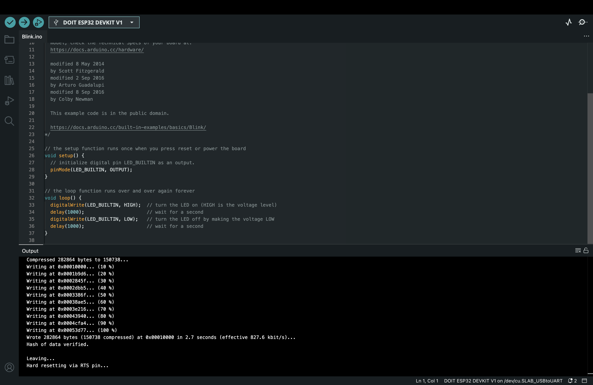

# IoT25-HW03

## Purpose
Set ESP32 Board at Arduino IDE 2.0, Check if the board operates well with Example Blink

---

## Arduino IDE Setting
- Board: DOIT ESP32 DEVKIT V1
- Port: /dev/cu.SLAB_USBtoUART



---

## Blink Example Video
(https://youtube.com/shorts/5IxnP190IlY?si=GDXLIBXNyI5YGVs0)

---

## Code

```cpp
void setup() {
  pinMode(LED_BUILTIN, OUTPUT);
}

void loop() {
  digitalWrite(LED_BUILTIN, HIGH);
  delay(1000);
  digitalWrite(LED_BUILTIN, LOW);
  delay(1000);
}
